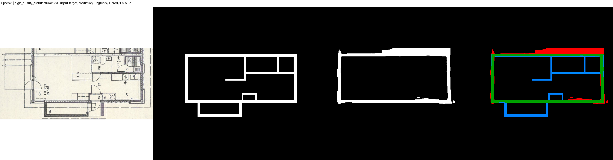
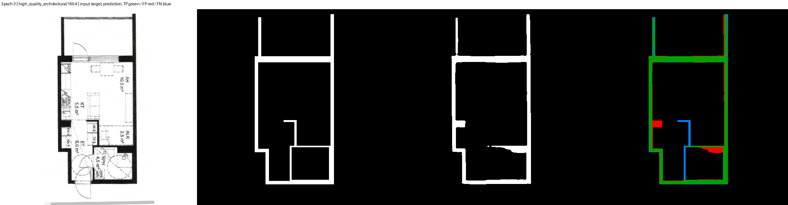
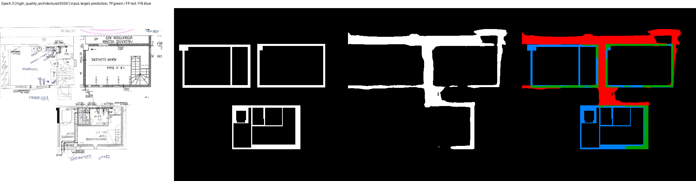
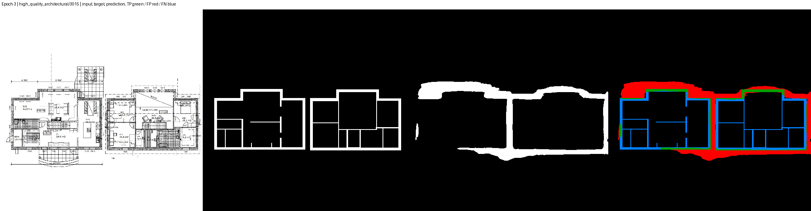

# Visual QA - MitUNet 1024 High-Resolution Crop Treatment

These four PNGs are historical validation composites from the best treatment checkpoint at epoch 3. Each image shows the source plan, ground-truth wall mask, predicted wall mask, and an error overlay with true positives in green, false positives in red, and false negatives in blue.

No training or inference was run to create this audit copy.

| Sample | Artifact | Qualitative note |
| --- | --- | --- |
| `high_quality_architectural/333` | [epoch_003_01.png](epoch_003_01.png) | Thick exterior false positives and missed interior partitions are visible. |
| `high_quality_architectural/1654` | [epoch_003_02.png](epoch_003_02.png) | The outer shape is mostly recovered, with local edge overprediction and interior false negatives. |
| `high_quality_architectural/5559` | [epoch_003_03.png](epoch_003_03.png) | Dense plan with broad exterior overprediction and substantial missed interior structure. |
| `high_quality_architectural/3015` | [epoch_003_04.png](epoch_003_04.png) | Two-wing plan showing thick exterior predictions and widespread interior-wall misses. |

## Best-Epoch Composites

